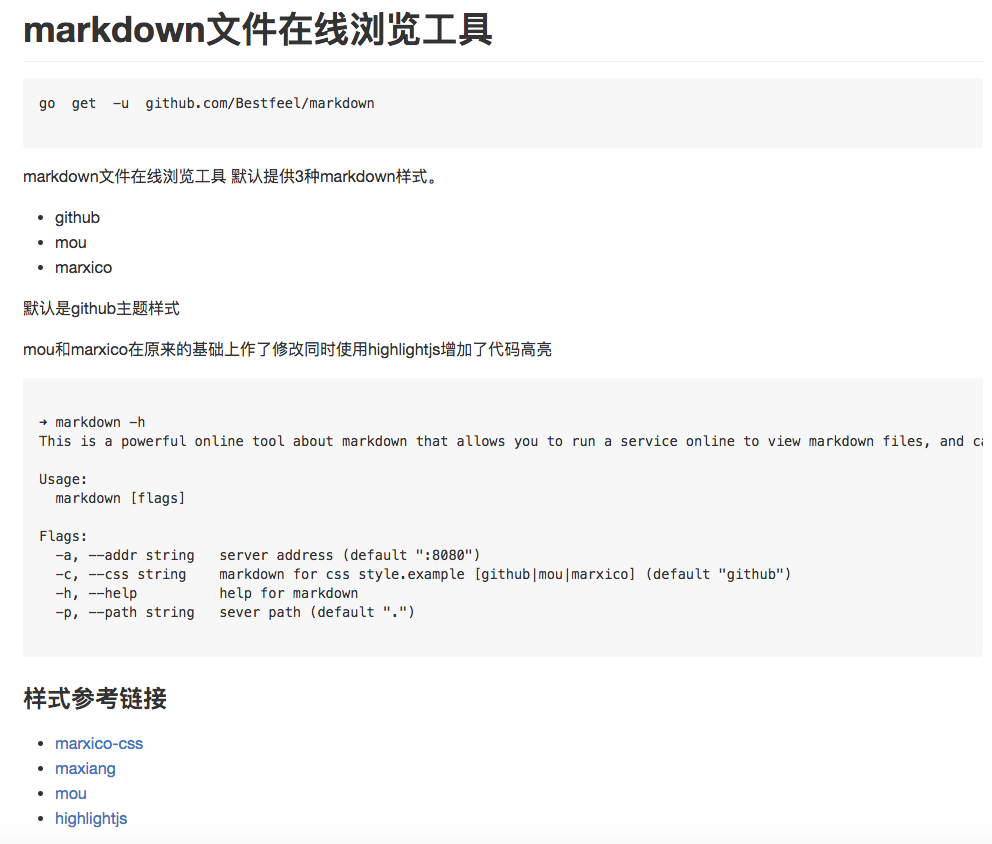
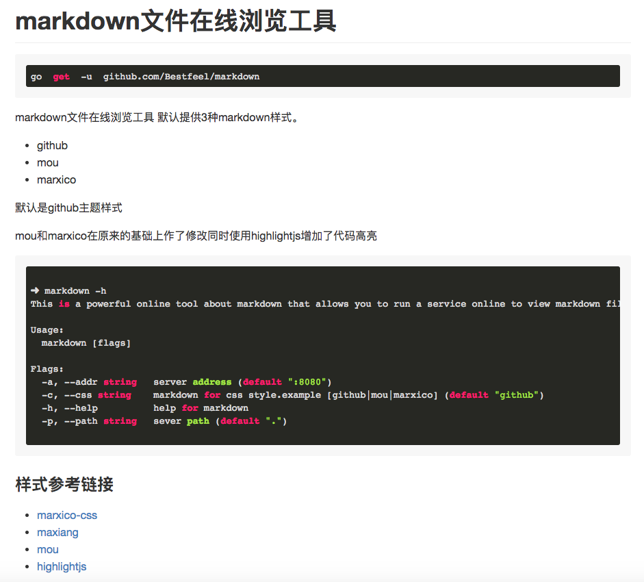

markdown文件在线浏览工具
=======================


```
go  get  -u  github.com/Bestfeel/markdown

```


markdown文件在线浏览工具
默认提供3种markdown样式。

* github
* mou
* marxico

默认是github主题样式

mou和marxico在原来的基础上作了修改同时使用highlightjs增加了代码高亮






```

➜ markdown -h
Powerful markdown online,You can run server online view  markdown File  or  as   static File  server.

Usage:
  markdown [flags]

Flags:
  -a, --addr string   server address (default ":8080")
  -c, --css string    markdown for css style.example [github|mou|marxico] (default "github")
  -h, --help          help for markdown
  -p, --path string   sever path (default ".")

```

### 样式参考链接

* [marxico-css](https://dn-maxiang.qbox.me/res-min/themes/marxico.css?1449717601371)
* [maxiang](https://maxiang.io/)
* [mou](https://github.com/hzlzh/MarkDown-Theme)
* [highlightjs](https://highlightjs.org/)